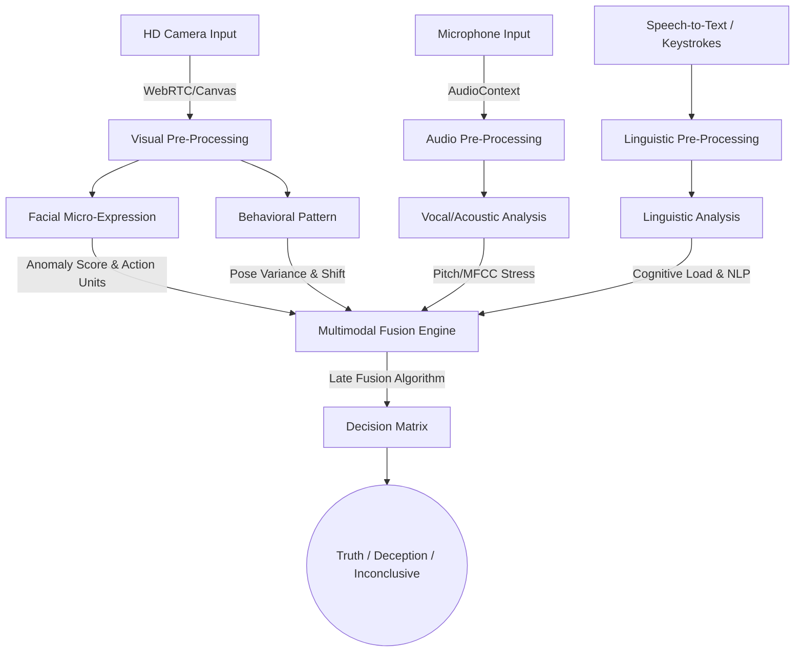

# Real-Time Deception Detection Architecture

This document details the architecture for the **Multimodal Deception Detection & Behavioral Analysis System**.

## 1. High-Level Architecture & Data Flow

The system uses a late-fusion multimodal architecture to evaluate four distinct data streams simultaneously.

## 2. Analysis Modules & Key Algorithms

### 2.1. Facial Micro-Expression Analysis (FACS)
- **Data Source**: Frame-by-frame 60 FPS video tracking.
- **Algorithm**: Convolutional Neural Network (CNN) trained on Facial Action Coding System (FACS) action units (AUs).
- **Key Indicators**: 
  - Asymmetrical expressions (e.g., smirk masking fear).
  - Micro-expressions (lasting < 0.2s) showing contradictory emotion (e.g., flash of disgust when stating happiness).
  - Blink rate variance and eye-darting (saccadic movements).

### 2.2. Vocal/Acoustic Analysis
- **Data Source**: Raw audio waveform and Mel-frequency cepstral coefficients (MFCCs).
- **Algorithm**: Support Vector Machine (SVM) or Transformer over MFCC temporal windows.
- **Key Indicators**: 
  - Fundamental frequency (f0) micro-tremors (involuntary laryngeal muscle tightening).
  - Voice Pitch shifts corresponding to cognitive loading.
  - Speech rate variations and duration of pause fillers (um, ah).

### 2.3. Linguistic/Content Analysis
- **Data Source**: Real-time transcribed text via Web Speech API or Deepgram.
- **Algorithm**: NLP embedding models (e.g., BERT/RoBERTa) for sentiment vs. semantic alignment.
- **Key Indicators**:
  - Distancing language (drop of "I" or "my", moving to third person).
  - Over-specificity vs. lack of core detail.
  - Cognitive load indicators (complex sentence structures masking simple truths).

### 2.4. Behavioral Pattern Recognition
- **Data Source**: Skeletal/Head pose tracking via MediaPipe.
- **Algorithm**: Hidden Markov Models (HMM) tracking kinesthetic baselines.
- **Key Indicators**:
  - Posture shifts coinciding with high-stakes questions.
  - Grooming behaviors (touching face/neck).
  - Lack of illustrators (hand movements) when speaking.

## 3. Integration Strategy (The Fusion Engine)

The system relies on a **Late Fusion Strategy**. Instead of concatenating raw features (Early Fusion), each module outputs a normalized sequence of "Deception Probabilities" and "Confidence Scores".

### Fusion Algorithm
$$ Fusion Score = \sum_{i=1}^{4} (W_i \times S_i) + \alpha (MaxSpike) $$
Where $W$ is the dynamic weight of the modality, $S$ is the stress score, and $\alpha$ is a non-linear activation coefficient for extreme spikes.

**Decision Matrix Logic:**
1. **TRUTH**: Fusion Score < Threshold (e.g., 40%) AND no single modality detects extreme deception.
2. **DECEPTION**: Fusion Score > High Threshold (e.g., 75%) OR two modalities show high correlation of micro-stressors.
3. **INCONCLUSIVE**: Fusion Score between 40% and 75%, OR modalities show high confidence but completely contradictory data.

## 4. Handling Contradictions (Edge Cases)

Human deception is non-linear. The system handles conflicting signals through **Contextual Attention Weighting**.

* **Scenario**: Confident voice (low acoustic stress) + High visual anomalies (eye darting, face touching).
* **System Logic**: Psychopaths or highly trained subjects often control their voice and linguistic structure perfectly. However, the autonomic nervous system 'leaks' via micro-expressions.
* **Resolution**: The Fusion Engine detects the variance anomaly. If Audio Stress is at 10% but Visual Stress spikes to 90%, the system lowers the weight of the audio stream (assuming it is being consciously suppressed) and boosts the visual weight, pushing the verdict towards DECEPTION with the explicit explanation: *"Vocal pitch aggressively controlled while autonomic visual indicators spiked."*

## 5. Security & Privacy
- Zero centralized storage of raw biometrics. All CNN processing operates client-side via WebAssembly (WASM).
- Data streams ephemeral. Only aggregate stress variables are exported upon session end.
